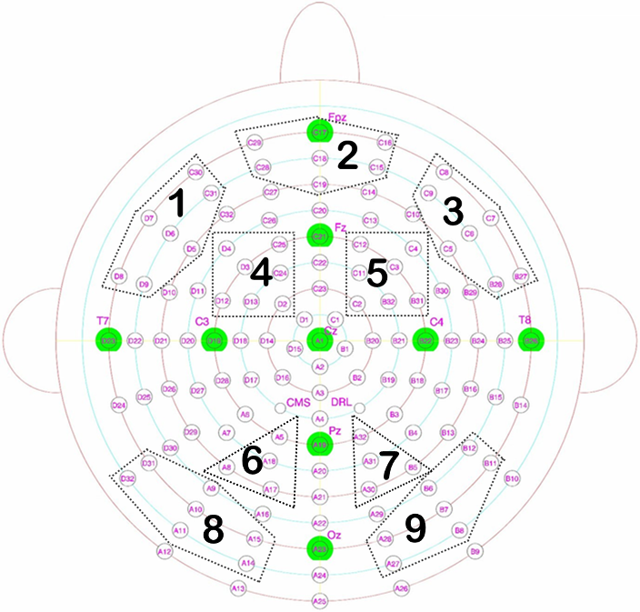

# Plotting Event Related Potentials using Biosemi Active-2 128-Electrode System Data
**Introduction**: This script was originally intended for members of my laboratory to help them plot event-related potentials from our Biosemi Active 2 128-Electrode EEG system. The data that is plotted here is taken from an experiment where we asked medical students to provide "Can Define", "Familiar" and "Don't Know" responses to anatomical terms shown on a computer screen. The data are not provided since this data is still unpublished.

**Open the .Rmd file, press CTRL+ALT+R to run the entire script.**

**Load library used to read in data and manipulate data.**

    library(plyr)

**First set your working directory.** *Press CTRL+SHIFT+H*

**Reads directory where files are located. Note that the "path" argument
needs to be set to the directory where all the txt files exist.** Note
the path argument below needs to change if the files are in a different
place.

    filesCD <- list.files(path = "/media/mihcelle/ChelleUSB/SubMemory 7.20/CD/", pattern="*.txt", full.names=TRUE)
    filesFAM <- list.files(path = "/media/mihcelle/ChelleUSB/SubMemory 7.20/FAM/",pattern="*.txt", full.names=TRUE)
    filesDK <- list.files(path = "/media/mihcelle/ChelleUSB/SubMemory 7.20/DK/", pattern="*.txt", full.names=TRUE)

**\# Imports all files TEXT files into R, store data frames in a large
list object named `dataCD`, `dataFAM`, and `dataDK`.**

    dataCD<-lapply(filesCD, read.delim, header = FALSE)
    dataFAM<-lapply(filesFAM, read.delim, header = FALSE)
    dataDK<-lapply(filesDK, read.delim, header = FALSE)

**Set the subject IDs.**

    IDs <- c("1115", "1140", "1181", "1220", "1337", "1414", "1424", "1498", "1513", "1581", "1651", "1775", "1833", "2000","2001", "2003", "2004", "2005", "2007", "2010", "2011", "2013", "2014", "2015" ,"2016", "2017", "2018", "2020","2022", "2023", "2025" ,"2027", "2028", "2029")

**This next part snips unnecessary electrode data.**

    dataCD<-lapply(dataCD, function(x) x[, -c(129:140)])
    dataFAM<-lapply(dataFAM, function(x) x[,-c(129:140)])
    dataDK<-lapply(dataDK, function(x) x[,-c(129:140)])

**Let's check that it did it properly.**

    ncol(dataCD[[1]])

    ## [1] 128

**The `ncol()` function returns 128 columns.** This corresponds to 128
electrodes.

**Now we need to find the grand means for each response type.** This
means finding the mean for each individual element (i.e., individuall
spreadsheet cell) across *all subjects*. This will spit out matrices
titled Mean\_CD, Mean\_FAM, and Mean\_DK.

    Mean_CD = aaply(laply(dataCD, as.matrix),c(2,3), mean)
    Mean_FAM = aaply(laply(dataFAM, as.matrix),c(2,3), mean)
    Mean_DK= aaply(laply(dataDK, as.matrix),c(2,3), mean)

    Mean_CD <- as.data.frame(Mean_CD)
    Mean_FAM <- as.data.frame(Mean_FAM)
    Mean_DK <- as.data.frame(Mean_DK)

**Let's just check and make sure it's completed properly...**

    head(Mean_CD,5)

    ##              V1           V2           V3           V4           V5
    ## 1  4.103468e-08 2.228300e-07 1.489553e-07 1.805165e-07 1.263515e-07
    ## 2  3.366382e-08 2.077146e-07 1.402744e-07 1.704094e-07 1.198974e-07
    ## 3  1.355176e-08 1.654538e-07 1.140310e-07 1.393947e-07 9.953441e-08
    ## 4 -1.429353e-08 1.052385e-07 7.140706e-08 8.901676e-08 6.564235e-08
    ## 5 -4.384382e-08 4.015735e-08 1.874441e-08 2.934941e-08 2.343891e-08
    ##              V6            V7           V8            V9           V10
    ## 1 -7.093794e-08 -3.760353e-08 9.295088e-08 -6.829618e-08 -2.815968e-07
    ## 2 -7.469882e-08 -4.192794e-08 9.399935e-08 -6.422706e-08 -2.608305e-07
    ## 3 -8.460882e-08 -5.434824e-08 9.334559e-08 -5.470588e-08 -2.063335e-07
    ## 4 -9.693203e-08 -7.220412e-08 8.387559e-08 -4.560085e-08 -1.373312e-07
    ## 5 -1.073703e-07 -9.144529e-08 6.209500e-08 -4.247744e-08 -7.643235e-08
    ## .
    ## .
    ## .
    ##            V126          V127          V128
    ## 1 -3.913529e-09 -1.068085e-07 -1.568559e-07
    ## 2  1.644412e-09 -9.583276e-08 -1.472541e-07
    ## 3  1.544706e-08 -6.641912e-08 -1.220035e-07
    ## 4  3.161588e-08 -2.711853e-08 -8.869206e-08
    ## 5  4.097638e-08  8.331765e-09 -5.902019e-08

**Next, we want to define the Regions of Interest (ROIs).** In each
dataframe, columns titled *V1-V120* refer to the electrode site on each
EEG cap. Each column in the raw datafiles represent an electrode. ROIs
can then be grouped however you wish to group them. You just need to
change up the names in the variables below to do that.

    ROI1 <- c("V94","V95","V101","V102","V103","V104","V105");
    ROI2 <- c("V59","V60","V69","V70","V71","V72","V73")
    ROI3 <- c("V88","V89","V98","V99","V100","V108","V109")
    ROI4 <- c("V63","V64","V66","V67","V68","V75","V76")
    ROI5 <- c("V6","V7","V8","V113","V122","V123","V124","V125")
    ROI6 <- c("V5","V6","V7","V17","V18")
    ROI7 <- c("V30","V31","V32","V35","V36")
    ROI8 <- c("V79","V80","V81","V82","V83","V92","V93")
    ROI9 <- c("V3","V4","V5","V19", "V20", "V32", "V34", "V112")

**Set up time points for later plotting.**

    time<-seq(-200, 2000, length = 564)
    time<-round(time)

**Find the row means for each ROI, convert the variable into a
dataframe.**

    Mean_CD_ROI1 <- rowMeans(Mean_CD[ROI1]); Mean_CD_ROI1 <- as.data.frame(Mean_CD_ROI1)
    Mean_CD_ROI2 <- rowMeans(Mean_CD[ROI2]); Mean_CD_ROI2 <- as.data.frame(Mean_CD_ROI2)
    Mean_CD_ROI3 <- rowMeans(Mean_CD[ROI3]); Mean_CD_ROI3 <- as.data.frame(Mean_CD_ROI3)
    Mean_CD_ROI4 <- rowMeans(Mean_CD[ROI4]); Mean_CD_ROI4 <- as.data.frame(Mean_CD_ROI4)
    Mean_CD_ROI5 <- rowMeans(Mean_CD[ROI5]); Mean_CD_ROI5 <- as.data.frame(Mean_CD_ROI5)
    Mean_CD_ROI6 <- rowMeans(Mean_CD[ROI6]); Mean_CD_ROI6 <- as.data.frame(Mean_CD_ROI6)
    Mean_CD_ROI7 <- rowMeans(Mean_CD[ROI7]); Mean_CD_ROI7 <- as.data.frame(Mean_CD_ROI7)
    Mean_CD_ROI8 <- rowMeans(Mean_CD[ROI8]); Mean_CD_ROI8 <- as.data.frame(Mean_CD_ROI8)
    Mean_CD_ROI9 <- rowMeans(Mean_CD[ROI9]); Mean_CD_ROI9 <- as.data.frame(Mean_CD_ROI9)

**Again, we need to check it it was completed properly.**

    head(Mean_CD_ROI2,5)

    ##   Mean_CD_ROI2
    ## 1 7.732556e-08
    ## 2 6.586733e-08
    ## 3 4.346343e-08
    ## 4 3.161224e-08
    ## 5 3.974454e-08

**Now we do this for Familiar responses and Don't Know responses...**

    Mean_FAM_ROI1 <- rowMeans(Mean_FAM[ROI1]); Mean_FAM_ROI1 <- as.data.frame(Mean_FAM_ROI1)
    Mean_FAM_ROI2 <- rowMeans(Mean_FAM[ROI2]); Mean_FAM_ROI2 <- as.data.frame(Mean_FAM_ROI2)
    Mean_FAM_ROI3 <- rowMeans(Mean_FAM[ROI3]); Mean_FAM_ROI3 <- as.data.frame(Mean_FAM_ROI3)
    Mean_FAM_ROI4 <- rowMeans(Mean_FAM[ROI4]); Mean_FAM_ROI4 <- as.data.frame(Mean_FAM_ROI4)
    Mean_FAM_ROI5 <- rowMeans(Mean_FAM[ROI5]); Mean_FAM_ROI5 <- as.data.frame(Mean_FAM_ROI5)
    Mean_FAM_ROI6 <- rowMeans(Mean_FAM[ROI6]); Mean_FAM_ROI6 <- as.data.frame(Mean_FAM_ROI6)
    Mean_FAM_ROI7 <- rowMeans(Mean_FAM[ROI7]); Mean_FAM_ROI7 <- as.data.frame(Mean_FAM_ROI7)
    Mean_FAM_ROI8 <- rowMeans(Mean_FAM[ROI8]); Mean_FAM_ROI8 <- as.data.frame(Mean_FAM_ROI8)
    Mean_FAM_ROI9 <- rowMeans(Mean_FAM[ROI9]); Mean_FAM_ROI9 <- as.data.frame(Mean_FAM_ROI9)

    Mean_DK_ROI1 <- rowMeans(Mean_DK[ROI1]); Mean_DK_ROI1 <- as.data.frame(Mean_DK_ROI1)
    Mean_DK_ROI2 <- rowMeans(Mean_DK[ROI2]); Mean_DK_ROI2 <- as.data.frame(Mean_DK_ROI2)
    Mean_DK_ROI3 <- rowMeans(Mean_DK[ROI3]); Mean_DK_ROI3 <- as.data.frame(Mean_DK_ROI3)
    Mean_DK_ROI4 <- rowMeans(Mean_DK[ROI4]); Mean_DK_ROI4 <- as.data.frame(Mean_DK_ROI4)
    Mean_DK_ROI5 <- rowMeans(Mean_DK[ROI5]); Mean_DK_ROI5 <- as.data.frame(Mean_DK_ROI5)
    Mean_DK_ROI6 <- rowMeans(Mean_DK[ROI6]); Mean_DK_ROI6 <- as.data.frame(Mean_DK_ROI6)
    Mean_DK_ROI7 <- rowMeans(Mean_DK[ROI7]); Mean_DK_ROI7 <- as.data.frame(Mean_DK_ROI7)
    Mean_DK_ROI8 <- rowMeans(Mean_DK[ROI8]); Mean_DK_ROI8 <- as.data.frame(Mean_DK_ROI8)
    Mean_DK_ROI9 <- rowMeans(Mean_DK[ROI9]); Mean_DK_ROI9 <- as.data.frame(Mean_DK_ROI9)

**OK, like in the grand average script, we need to bind everything into
a single data frame.**

    Omnibus_DF <- cbind(Mean_CD_ROI1, Mean_CD_ROI2, Mean_CD_ROI3, Mean_CD_ROI4, Mean_CD_ROI5, Mean_CD_ROI6, Mean_CD_ROI7, Mean_CD_ROI8, Mean_CD_ROI9, Mean_FAM_ROI1, Mean_FAM_ROI2, Mean_FAM_ROI3, Mean_FAM_ROI4, Mean_FAM_ROI5, Mean_FAM_ROI6, Mean_FAM_ROI7, Mean_FAM_ROI8, Mean_FAM_ROI9, Mean_DK_ROI1, Mean_DK_ROI2, Mean_DK_ROI3, Mean_DK_ROI4,Mean_DK_ROI5, Mean_DK_ROI6, Mean_DK_ROI7, Mean_DK_ROI8, Mean_DK_ROI9)

**Double check the `Omnibus_DF` data frame.**

    head(Omnibus_DF, 5)

    ##    Mean_CD_ROI1 Mean_CD_ROI2  Mean_CD_ROI3  Mean_CD_ROI4  Mean_CD_ROI5
    ## 1 -2.473503e-07 7.732556e-08 -1.898370e-07 -2.027613e-09  3.207547e-08
    ## 2 -2.555471e-07 6.586733e-08 -1.950126e-07 -2.126073e-08  3.045816e-08
    ## 3 -2.677480e-07 4.346343e-08 -2.065729e-07 -6.831593e-08  2.515537e-08
    ## 4 -2.616619e-07 3.161224e-08 -2.178026e-07 -1.215094e-07  1.531258e-08
    ## 5 -2.321008e-07 3.974454e-08 -2.279146e-07 -1.630013e-07 -2.192353e-10

**Finally, we get to plotting.** We use the basic base-R plotting
functions here, but you could use the `ggplot` package if you wanted
nicer plots. Each plot has a lot of arguments, so check out ?plot,
?lines, and ?legend to understand them. I'll go through the plots more
generally step by step.

`plot()` calls the plotting function. Note we first build the plot using
the ROI 1 data first. The `lines()` function will overlay additional
lines on the original plot, in this case, we call ROI 1 data for
Familiar, and Don't Know, then overlay them over the Can Defines.

`line_names()` specifies the line names for a legend. `legend()` will
place a legend on the figure, consisting of our line names (which is
used in the argument.)

First, we convert the values into more readable data.

    Omnibus_DF <- Omnibus_DF*10**6
    Omnibus_DF <- cbind(Omnibus_DF, time)

**Now we start creating plots.** We start with ROI 1 thru ROI 9. A visualization of where the ROIs lie on the scalp can be seen below:

**Note that in the script itself, the plots will pop up, and you can right click to save them!**
------------------------------------------------------------------------------------------------

    plot(Omnibus_DF[c("time", "Mean_CD_ROI1")], type = 'l', xlab = "Time In Seconds", ylab = "uV (microvolts)", xlim=c(-200,2000), ylim=c(-3.5, 3.5), main = "ROI 1", col = "blue", cex.lab = .75, cex.axis = .65)
    lines(Omnibus_DF[c("time", "Mean_FAM_ROI1")], col = "green", lty = 2)
    lines(Omnibus_DF[c("time", "Mean_DK_ROI1")], col = "red", lty = 3)
    line_names <-c("Can Define", "Familiar", "Don't Know")
    legend('topright', line_names, col = c("blue", "green", "red"), lty = c(1,2,3), cex = .75)

**ROI 2**

    plot(Omnibus_DF[c("time", "Mean_CD_ROI2")], type = 'l', xlab = "Time In Seconds", ylab = "uV (microvolts)", ylim=c(-3.5, 3.5), main = "ROI 2", col = "blue", cex.lab = .75, cex.axis = .75, xaxt = 'n')
    axis(1, seq(-200,2000, by = 200), cex.axis = .75)
    lines(Omnibus_DF[c("time", "Mean_FAM_ROI2")], col = "green", lty = 2)
    lines(Omnibus_DF[c("time", "Mean_DK_ROI2")], col = "red", lty = 3)
    line_names <-c("Can Define", "Familiar", "Don't Know")
    legend('topright', line_names, col = c("blue", "green", "red"), lty = c(1,2,3), cex = .75)

**ROI 3**

    plot(Omnibus_DF[c("time", "Mean_CD_ROI3")], type = 'l', xlab = "Time In Seconds", ylab = "uV (microvolts)", xlim=c(-200,2000), ylim=c(-3.5, 3.5), main = "ROI 3", col = "blue", cex.lab = .75, cex.axis = .75, xaxt = 'n')
    axis(1, seq(-200,2000, by = 200), cex.axis = .75)
    lines(Omnibus_DF[c("time", "Mean_FAM_ROI3")], col = "green", lty = 2)
    lines(Omnibus_DF[c("time", "Mean_DK_ROI3")], col = "red", lty = 3)
    line_names <-c("Can Define", "Familiar", "Don't Know")
    legend('topright', line_names, col = c("blue", "green", "red"), lty = c(1,2,3), cex = .75)

**ROI 4**

    plot(Omnibus_DF[c("time", "Mean_CD_ROI4")], type = 'l', xlab = "Time In Seconds", ylab = "uV (microvolts)", xlim=c(-200,2000), ylim=c(-3.5, 3.5), main = "ROI 4", col = "blue", cex.lab = .75, cex.axis = .75, xaxt = 'n')
    axis(1, seq(-200,2000, by = 200), cex.axis = .75)
    lines(Omnibus_DF[c("time", "Mean_FAM_ROI4")], col = "green", lty = 2)
    lines(Omnibus_DF[c("time", "Mean_DK_ROI4")], col = "red", lty = 3)
    line_names <-c("Can Define", "Familiar", "Don't Know")
    legend('topright', line_names, col = c("blue", "green", "red"), lty = c(1,2,3), cex = .75)

**ROI 5**

    plot(Omnibus_DF[c("time", "Mean_CD_ROI5")], type = 'l', xlab = "Time In Seconds", ylab = "uV (microvolts)", xlim=c(-200,2000), ylim=c(-3.5, 3.5), main = "ROI 5", col = "blue", cex.lab = .75, cex.axis = .75, xaxt = 'n')
    axis(1, seq(-200,2000, by = 200), cex.axis = .75)
    lines(Omnibus_DF[c("time", "Mean_FAM_ROI5")], col = "green", lty = 2)
    lines(Omnibus_DF[c("time", "Mean_DK_ROI5")], col = "red", lty = 3)
    line_names <-c("Can Define", "Familiar", "Don't Know")
    legend('topright', line_names, col = c("blue", "green", "red"), lty = c(1,2,3), cex = .75)

**ROI 6**

    plot(Omnibus_DF[c("time", "Mean_CD_ROI6")], type = 'l', xlab = "Time In Seconds", ylab = "uV (microvolts)", xlim=c(-200,2000), ylim=c(-3.5, 3.5), main = "ROI 6", col = "blue", cex.lab = .75, cex.axis = .75, xaxt = 'n')
    axis(1, seq(-200,2000, by = 200), cex.axis = .75)
    lines(Omnibus_DF[c("time", "Mean_FAM_ROI6")], col = "green", lty = 2)
    lines(Omnibus_DF[c("time", "Mean_DK_ROI6")], col = "red", lty = 3)
    line_names <-c("Can Define", "Familiar", "Don't Know")
    legend('topright', line_names, col = c("blue", "green", "red"), lty = c(1,2,3), cex = .75)

**ROI 7**

    plot(Omnibus_DF[c("time", "Mean_CD_ROI7")], type = 'l', xlab = "Time In Seconds", ylab = "uV (microvolts)", xlim=c(-200,2000), ylim=c(-3.5, 3.5), main = "ROI 7", col = "blue", cex.lab = .75, cex.axis = .75, xaxt = 'n')
    axis(1, seq(-200,2000, by = 200), cex.axis = .75)
    lines(Omnibus_DF[c("time", "Mean_FAM_ROI7")], col = "green", lty = 2)
    lines(Omnibus_DF[c("time", "Mean_DK_ROI7")], col = "red", lty = 3)
    line_names <-c("Can Define", "Familiar", "Don't Know")
    legend('topright', line_names, col = c("blue", "green", "red"), lty = c(1,2,3), cex = .75)

**ROI 8**

    plot(Omnibus_DF[c("time", "Mean_CD_ROI8")], type = 'l', xlab = "Time In Seconds", ylab = "uV (microvolts)", xlim=c(-200,2000), ylim=c(-3.5, 3.5), main = "ROI 8", col = "blue", cex.lab = .75, cex.axis = .75, xaxt = 'n')
    axis(1, seq(-200,2000, by = 200), cex.axis = .75)
    lines(Omnibus_DF[c("time", "Mean_FAM_ROI8")], col = "green", lty = 2)
    lines(Omnibus_DF[c("time", "Mean_DK_ROI8")], col = "red", lty = 3)
    line_names <-c("Can Define", "Familiar", "Don't Know")
    legend('topright', line_names, col = c("blue", "green", "red"), lty = c(1,2,3), cex = .75)

**ROI 9**

    plot(Omnibus_DF[c("time", "Mean_CD_ROI9")], type = 'l', xlab = "Time In Seconds", ylab = "uV (microvolts)", xlim=c(-200,2000), ylim=c(-3.5, 3.5), main = "ROI 9", col = "blue", cex.lab = .75, cex.axis = .75, xaxt = 'n')
    axis(1, seq(-200,2000, by = 200), cex.axis = .75)
    lines(Omnibus_DF[c("time", "Mean_FAM_ROI9")], col = "green", lty = 2)
    lines(Omnibus_DF[c("time", "Mean_DK_ROI9")], col = "red", lty = 3)
    line_names <-c("Can Define", "Familiar", "Don't Know")
    legend('topright', line_names, col = c("blue", "green", "red"), lty = c(1,2,3), cex = .75)

